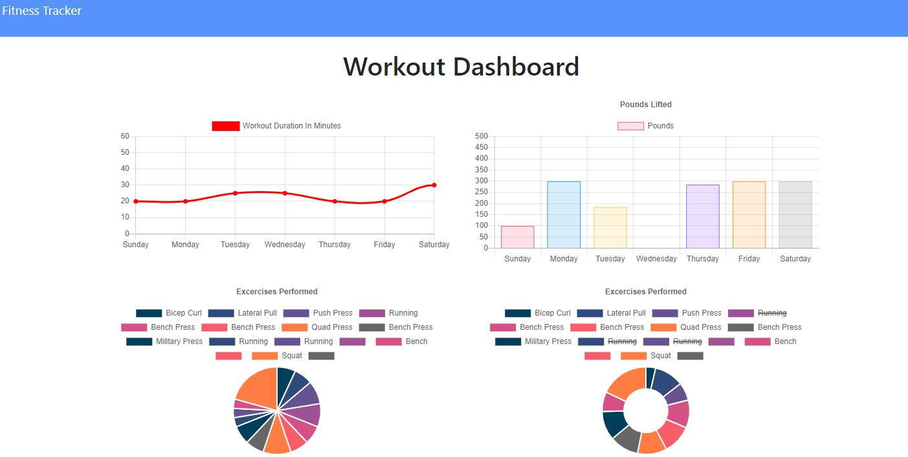

# GymBuddy

The only "Spotter" you will ever need!

Description:
This website lets you create and keep track of you workout's.

- Table of Contents:
  - [Installation](#installation)
  - [User_Story](#userstory)
  - [License](#license)
  - [Contributing](#contributing)
  - [Technologies](#technologies)
  - [Finished_Product](#finishedproduct)
  - [Questions](#questions)

## Installation:

This app can be access using Chrome and VS Code.

This app is deployed through Heroku and can be accessed through this link:
https://still-sierra-23537.herokuapp.com/

Github:
https://github.com/mandisareed/project-2.git

## User_Story:

As a user, I want to be able to view create and track daily workouts. I want to be able to log multiple exercises in a workout on a given day. I should also be able to track the name, type, weight, sets, reps, and duration of exercise. If the exercise is a cardio exercise, I should be able to track my distance traveled.

## License:

undefined

## Contributing:

https://github.com/robertluttig

## Technologies:

HTML + CSS + Javascript + Express

## Finished_Product:

## Questions:

Please reach out to either one of us for additional questions:

robert.luttig@gmail.com
